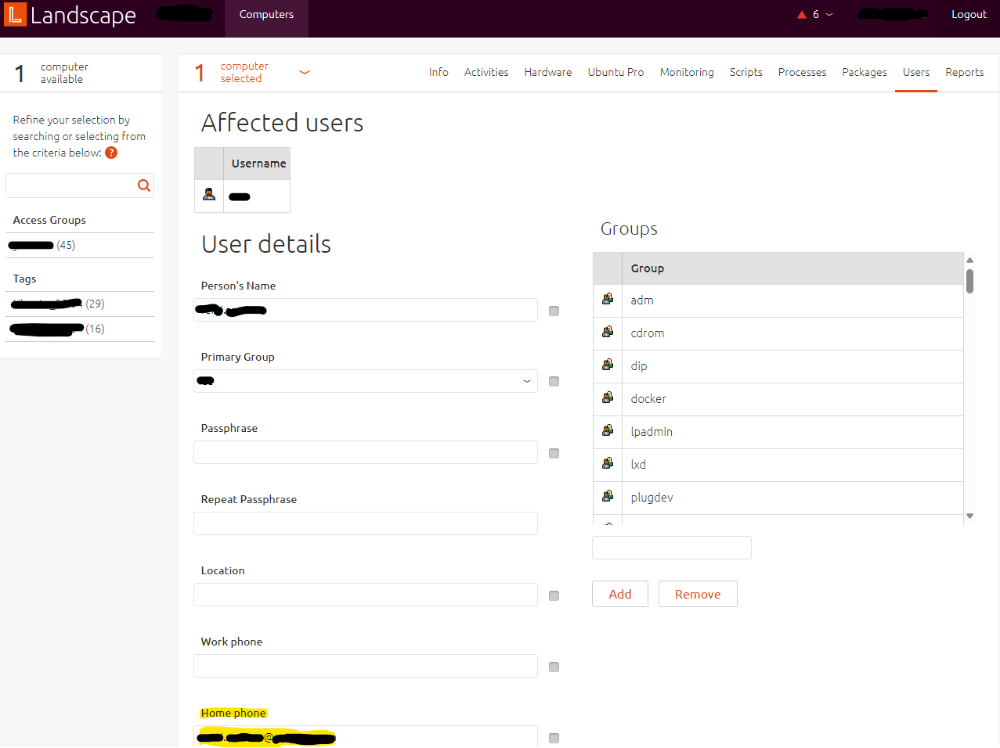
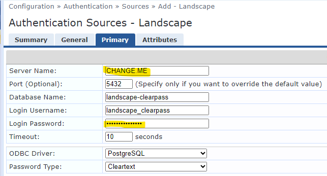

# Aruba ClearPass and Canonical Landscape integration
Or how to use Landscape as an authentication source in ClearPass to authenticate your Linux/Ubuntu workstations against your 802.1x infrastructure?

## What is this and how does it work?
This project, which is basically a humble readme serving as a documentation, describes how to interface Aruba ClearPass and Canonical Landscape (on-premise only, SaaS is not supported) so Landscape could be used as an authentication source in ClearPass Policy Manager. 
It can be used to authenticate wired or wireless devices in a 802.1x service, for example. 

A generic SQL authentication source is declared in ClearPass. It connects to the Landscape database server and pulls information from its databases. 

The authentication source is basically a SQL query, which must return the computer's MAC address as "user_password". Only one line is allowed. This "password" must match the Radius attribute Radius:IETF:Calling-Station-Id sent by the Wifi controller during the authentication request. 

Landscape stores data on multiple databases, and we must address them all using one SQL authentication source in ClearPass. For this reason, a specific database is created on the Landscape database server (but we could potentially store it on another PostgreSQL server!) and a foreign data wrapper is used to "mount" tables from the different Landscape databases into one database.

### ASSUMPTIONS:
* You are using an on-premise version of Landscape.
* You are running Landscape 23.03 (if not, make sure the schemas are similar).
* You have access to your Landscape database server and you can run shell and SQL commands against it.
* ClearPass 6.11 was used here, but other versions should work as well.
* User's email address is stored on the user's "home phone" property on Linux and on Landscape, and is used to identify the computer in Landscape:



## Preparing the database

### ClearPass database
We first need to create a new user that will specifically be used for ClearPass, then we can create a new database. The first command will ask you to specify a password for the user, keep this password in mind for later...

```bash
sudo -u postgres createuser --no-createdb --no-createrole --no-superuser --pwprompt landscape_clearpass
sudo -u postgres -- psql -c 'CREATE DATABASE "landscape-clearpass" with owner = landscape_clearpass;'
```

Now we can connect to the newly created database and create everything we need with the following command:
```bash
sudo -u postgres -- psql landscape-clearpass
```

Enter the following SQL queries to create everything we will need in Clearpass. **DON'T FORGET TO SET THE LANDSCAPE_CLEARPASS USER PASSWORD!!!**
```SQL
-- Granting permissions for user
GRANT SELECT ON ALL TABLES IN SCHEMA public TO landscape_clearpass;
ALTER DEFAULT PRIVILEGES IN SCHEMA public GRANT SELECT ON TABLES TO landscape_clearpass;

-- Foreign data wrapper extension: create extension, create data wrappers, create user mappings (don't forget to change the password!), grant usage
CREATE EXTENSION IF NOT EXISTS postgres_fdw;
CREATE SERVER landscape_foreign_main FOREIGN DATA WRAPPER postgres_fdw options (host 'localhost', port '5432', dbname 'landscape-standalone-main');
CREATE SERVER landscape_foreign_resource_1 FOREIGN DATA WRAPPER postgres_fdw options (host 'localhost', port '5432', dbname 'landscape-standalone-resource-1');
CREATE USER MAPPING FOR landscape_clearpass SERVER landscape_foreign_main OPTIONS (user 'landscape_clearpass', password '###_PASSWORD_###');
CREATE USER MAPPING FOR landscape_clearpass SERVER landscape_foreign_resource_1 OPTIONS (user 'landscape_clearpass', password '###_PASSWORD_###');
GRANT USAGE ON FOREIGN SERVER landscape_foreign_resource_1 to landscape_clearpass;
GRANT USAGE ON FOREIGN SERVER landscape_foreign_main to landscape_clearpass;

-- Creating foreign table
CREATE FOREIGN TABLE computer_user (
	id serial4, 
	computer_id int4, 
	uid int8, 
	primary_gid int8, 
	username text, 
	enabled bool, 
	name text, 
	location text, 
	home_phone text, 
	work_phone text
) server landscape_foreign_resource_1 options (schema_name 'public', table_name 'computer_user');

CREATE FOREIGN TABLE hardware_info (
	computer_id int4, 
	key text, 
	str_value text, 
	int_value int8, 
	str_value_vector tsvector
) server landscape_foreign_resource_1 options (schema_name 'public', table_name 'hardware_info');

CREATE FOREIGN TABLE computer (
	id serial4, 
	distribution_id int4,
	title text, 
	hostname text
) server landscape_foreign_main options (schema_name 'public', table_name 'computer');

CREATE FOREIGN TABLE distribution (
	id serial4, 
	description text,
	distributor text, 
	release text,
	code_name text
) server landscape_foreign_main options (schema_name 'public', table_name 'distribution');

-- This is for later use
CREATE EXTENSION IF NOT EXISTS tablefunc;
```

Finally, the user must be able to do SELECT queries on the foreign tables. 
```bash
sudo -u postgres -- psql landscape-standalone-main -c "GRANT SELECT ON TABLE public.distribution TO landscape_clearpass;"
sudo -u postgres -- psql landscape-standalone-main -c "GRANT SELECT ON TABLE public.computer TO landscape_clearpass;"
sudo -u postgres -- psql landscape-standalone-resource-1 -c "GRANT SELECT ON TABLE public.computer_user TO landscape_clearpass;"
sudo -u postgres -- psql landscape-standalone-resource-1 -c "GRANT SELECT ON TABLE public.hardware_info TO landscape_clearpass;"
```

### Allowing access to the database from the ClearPass server
Add "host landscape-clearpass landscape_clearpass ###_CLEARPASS_IP_### md5" to the pg_hba.conf file on your Landscape database server. This will allow the user landscape_clearpass to connect to the database landscape-clearpass from the IP address ###CLEARPASS_IP### (set to your ClearPass IP address, and don't forget the /32 after the address!).
``` bash
sudo bash -c "echo host landscape-clearpass landscape_clearpass ###_CLEARPASS_IP_###/32 md5 >> /etc/postgresql/12/main/pg_hba.conf"
```

Now edit the file "/etc/postgresql/12/main/postgresql.conf" (```sudo vim /etc/postgresql/12/main/postgresql.conf```) and make sure the "listen_addresses" is set to "*". Port should already be set to 5432.
```conf
#------------------------------------------------------------------------------
# CONNECTIONS AND AUTHENTICATION
#------------------------------------------------------------------------------

# - Connection Settings -

listen_addresses = '*'					# what IP address(es) to listen on;
                                        # comma-separated list of addresses;
                                        # defaults to 'localhost'; use '*' for all
                                        # (change requires restart)
port = 5432                             # (change requires restart)
```

Restart the PostgreSQL service to apply changes with the following command: ```sudo systemctl restart postgresql```.

Now run the command ```sudo -u postgres -- psql -l```. If everything is correct and the service restarted with no error, you should get a listing of all the databases.
```bash
# sudo -u postgres -- psql -l
                                              List of databases
              Name               |        Owner        | Encoding | Collate |  Ctype  |   Access privileges
---------------------------------+---------------------+----------+---------+---------+-----------------------
 landscape-clearpass             | landscape_clearpass | UTF8     | C.UTF-8 | C.UTF-8 |
 landscape-standalone-account-1  | postgres            | UTF8     | C.UTF-8 | C.UTF-8 |
 landscape-standalone-knowledge  | postgres            | UTF8     | C.UTF-8 | C.UTF-8 |
 landscape-standalone-main       | postgres            | UTF8     | C.UTF-8 | C.UTF-8 | =Tc/postgres         +
                                 |                     |          |         |         | postgres=CTc/postgres+
                                 |                     |          |         |         | readaccess=c/postgres
 landscape-standalone-package    | postgres            | UTF8     | C.UTF-8 | C.UTF-8 |
 landscape-standalone-resource-1 | postgres            | UTF8     | C.UTF-8 | C.UTF-8 | =Tc/postgres         +
                                 |                     |          |         |         | postgres=CTc/postgres+
                                 |                     |          |         |         | readaccess=c/postgres
 landscape-standalone-session    | postgres            | UTF8     | C.UTF-8 | C.UTF-8 |
 postgres                        | postgres            | UTF8     | C.UTF-8 | C.UTF-8 |
 template0                       | postgres            | UTF8     | C.UTF-8 | C.UTF-8 | =c/postgres          +
                                 |                     |          |         |         | postgres=CTc/postgres
 template1                       | postgres            | UTF8     | C.UTF-8 | C.UTF-8 | postgres=CTc/postgres+
                                 |                     |          |         |         | =c/postgres
(10 rows)
```

## ClearPass side

### Importing a pre-made authentication source
You don't want to create the authentcation source from scratch? Then simply download this file: [AuthSourceLandscape.xml](AuthSourceLandscape.xml).
There is no secret, leave the field empty.


Edit the authentication source and in the Primary tab set the server name to your ClearPass database server IP or DNS, and set the password. 



You may skip the next part now :smile:.

### Create a generic SQL authentication source
Login to your ClearPass Policy Manager server and navigate to Configuration > Authentication > Sources and add a new authentication source.


In the General tab, enter a name for the new authentication source, a description if you want so, and specify "Generic SQL DB" as type. In my case, I have lowered the cache timeout to 60 seconds to get almost real-time information from Landscape but you might want to adapt this setting to your need. 


In the Primary tab, enter the Landscape IP address or DNS of your Landscape database server, I have fixed the port to 5432 here but it should not be required since this is the default port. 
Specify the database name, user and password we have created during the database preparation step. 
Of course, set the ODBC driver to PostgreSQL and keep the password type set to Cleartext. 


And that's where the fun begins...


Create a first filter named "Authentication" with the following filter query, and set the attributes as in the screenshot: 
```SQL
select c.id, c.title, c.hostname, hi.str_value as User_Password, cu.home_phone as User_Name
from computer c, hardware_info hi, computer_user cu 
where c.id = hi.computer_id
and c.id = cu.computer_id 
and hi.key like 'pci.network:%.serial'
and cu.home_phone = LOWER('%{Radius:IETF:User-Name}')
and hi.str_value = '%{Connection:Client-Mac-Address-Colon}'
```


Create a first filter named "LandscapeInformation" with the following filter query, and set the attributes as in the screenshot. Remember the "tablefun" extension declared in the database? That's where it comes into play (the crosstab function).
```SQL
select * from crosstab(
'
select computer_id, computer_id, str_value from hardware_info hi 
where hi.computer_id = %{LandscapeComputerID}
and (
	hi.key = ''description''
	or hi.key = ''vendor''
	or hi.key = ''product''
	or hi.key = ''serial''
)
'
)
as ct(id integer, description text, vendor text, product text, serial text)
```


Create a first filter named "LandscapeInformationDistribution" with the following filter query, and set the attributes as in the screenshot: 
```SQL
select d.description, d.distributor, d.release, d.code_name 
from distribution d, computer c 
where c.id = %{LandscapeComputerID}
and d.id = c.distribution_id 
```


When saving the last two filters, you might be granted with the following error but you can safely ignore it. 


## Use case example

On the computer side, a wireless connection is created using "nmcli" as follow. This connection connects to the SSID "SSID_WIFI_TEST" with EAP-TLS, using the user's email address as identity. This identity will show in ClearPass as the username.
The certificate used by the connection is managed by "certmonger".
```bash
wifi=$(iwconfig 2>&1 | grep -i ieee | cut -d' ' -f1)
ssid="SSID_WIFI_TEST"
userEmail="user.email@address.com"
crt="/path/to/certificate.crt"
key="/path/to/private.key"
pas="Private Key Passcode"
nmcli c add type wifi ifname ${wifi} con-name ${ssid} 802-11-wireless.ssid ${ssid} 802-11-wireless-security.key-mgmt wpa-eap 802-1x.eap tls 802-1x.client-cert ${crt} 802-1x.private-key ${key} 802-1x.private-key-password ${pas} 802-1x.identity ${userEmail} 802-11-wireless.hidden yes autoconnect yes
```

A new authentication method based on EAP-TLS is created on ClearPass, comparing the certificate CN/SAN. This step can be ommited and the default EAP-TLS authentication method can be used instead.


A service is also created, matching the SSID and using the authentication method and source. Here, the service is also used with Microsoft Intune (Windows) devices but the authentication source "Local Repository" could be ommited if Intune is not in your scope. The authorization, roles and enforcement side of this service is out of scope here. 


When the computer connects to the SSID, a Radius request is sent by the Wifi controller to the ClearPass server... And it is accepted! The authentication source is not clearly identified but we will see later that it is the Landscape SQL source.


If we have a look at the Radius request attributes, we can see Radius:IETF:Calling-Station-Id contains the MAC address of the computer's wireless interface, and Radius:IETF:User-Name contains the user's email address (this is the identity parameter of the nmcli command).

If we deploy the Authorization and Computed attributes, we can see that all the attributes we checked ad "attribute" in the authentication source are indeed filled with data from Landscape. We could use those attributes in the role mapping or enforcement policies! Here, we can clearly identify the authentication souce :smile:.


## Going further

The Intune extension uses the computer's Intune UID to identify the computer, the certificate should contain this information in SAN attributs. In my case, the user's email address is used to identify the device which may not be ideal but there are not a lot of fields that can be used in Landscape to identify a computer and still be accessible from the computer side and stored in a certificate. The "comment" field from Landscape could be potentially used, and can be retrieved by adding a column in the foreign table mapping: 
* Database: landscape-standalone-main
* Table: computer
* Column: comment

The following SQL query doesn't use the user's email address to identify the computer against Landscape. It is less secure (it will simply tell if the computer exists in Landscape based on its MAC address) but a lot easier to work with.
```SQL
select c.id, c.title, c.hostname, hi.str_value as User_Password 
from computer c, hardware_info hi 
where c.id = hi.computer_id 
and hi.key like 'pci.network:%.serial' 
and hi.str_value = '%{Connection:Client-Mac-Address-Colon}';
```

I highly recommend using more information about the user to tell if it is allowed to connect. For example:
* An authorization source (such as Azure AD :wink:) can determine if the user is still "enabled" in the directory. 
* Now Microsoft Defender can be deployed on Linux devices with Intune, some information could be fetched by the ClearPass Microsoft Defender extension (***not tested yet!***).